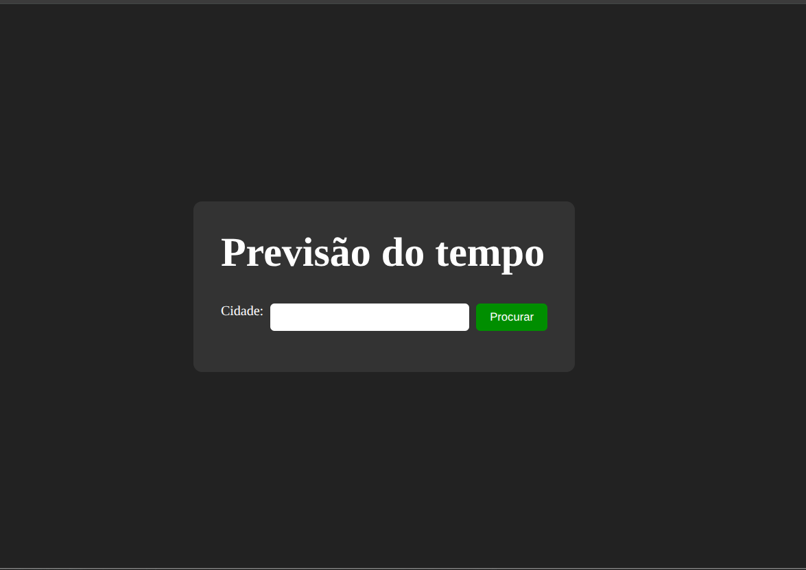
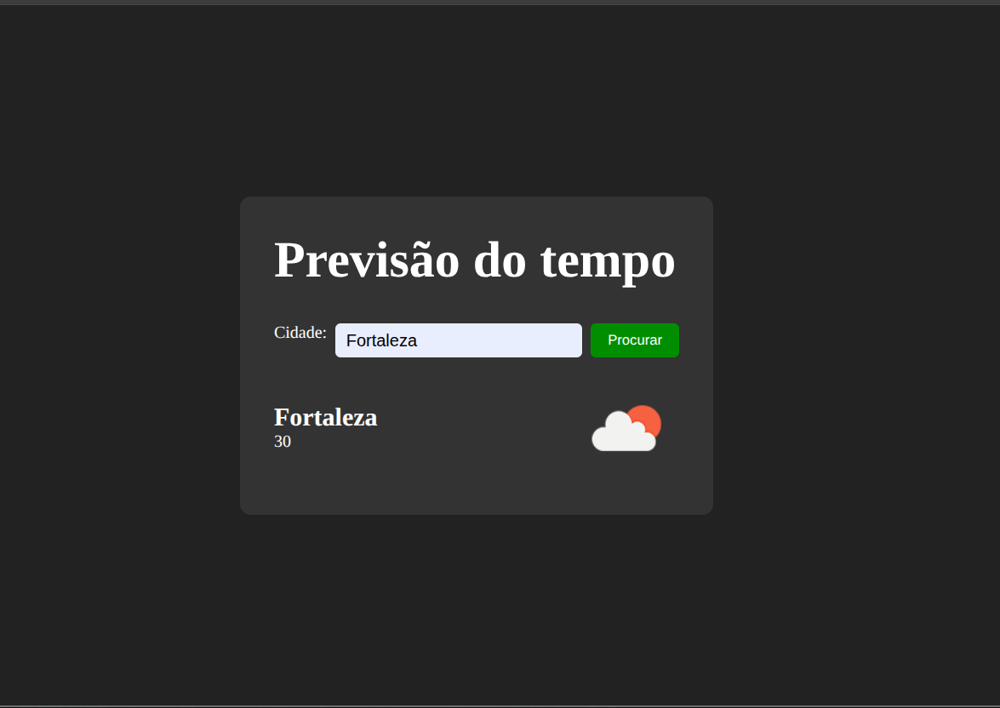

---

# 🌤️ Weather App — Consulta de Temperatura Atual

## 📌 Objetivo

Aplicação simples desenvolvida em **TypeScript** que consome uma API de clima para exibir a **temperatura atual** de qualquer cidade pesquisada pelo usuário.
Basta digitar o nome da cidade no campo de busca e o sistema retorna as informações de forma rápida e intuitiva.

---

## 🛠️ Tecnologias Utilizadas

* **TypeScript** — Tipagem estática para maior segurança no código.
* **HTML + CSS** — Estrutura e estilização da aplicação.
* **Fetch API** — Consumo da API de clima.
* **API de Clima** — [OpenWeatherMap](https://openweathermap.org/) (ou a que você utilizou, ajustar aqui).

---

## ⚙️ Como Executar o Projeto Localmente

1. **Clonar o repositório**

   ```bash
   git clone https://github.com/joycejsm/condicoes.git
   ```

2. **Instalar dependências**

   ```bash
   npm install
   ```

3. **Configurar a chave da API**

   * Crie uma conta na [OpenWeatherMap](https://openweathermap.org/) (ou API usada).
   * Gere sua chave de API.
   * No arquivo `src/config.ts` (ou onde estiver configurado), insira sua chave:

     ```ts
     export const API_KEY = "sua_chave_aqui";
     ```

4. **Rodar o projeto**

   ```bash
   npm run dev
   ```

   Acesse `http://localhost:5173` no navegador (ou a porta configurada).

---

## 💻 Funcionalidades

✅ Buscar cidade pelo nome.
✅ Exibir temperatura atual.
✅ Layout simples e responsivo.

---

## 📸 Prints da Aplicação

*(adicione prints da tela inicial e do resultado da busca aqui — pode colocar em uma pasta `docs/images` e referenciar com ``)*






---

## 🚀 Deploy

* [Acesse aqui a versão online](https://joycejsm.github.io/condicoes-tempo)

---

